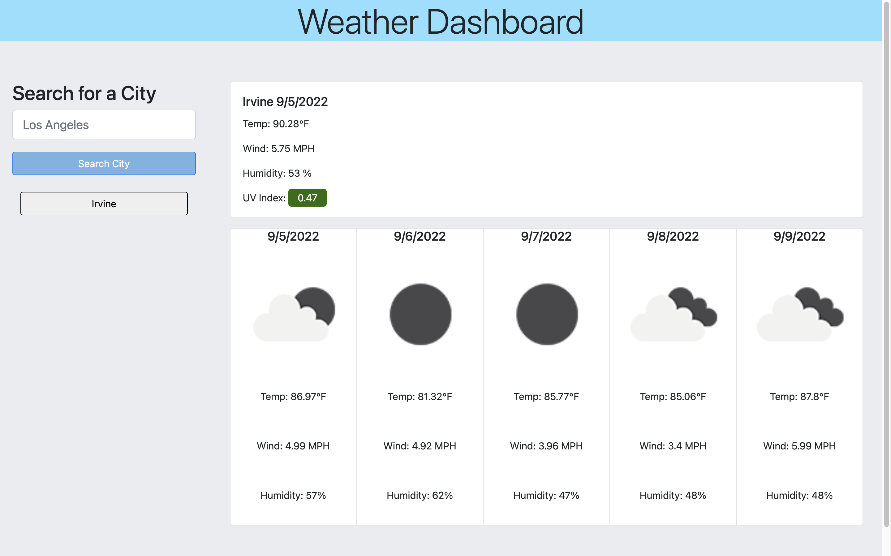
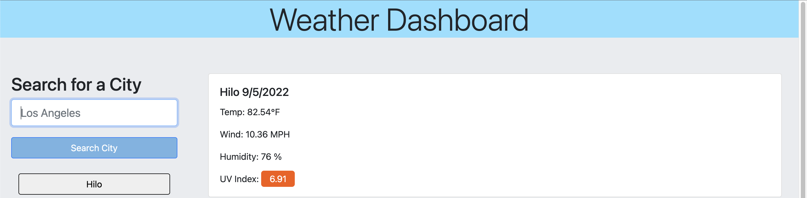
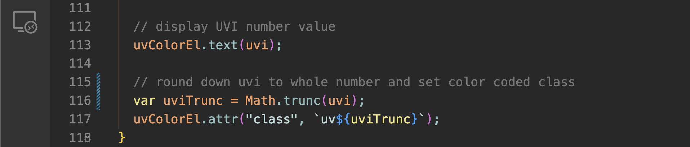
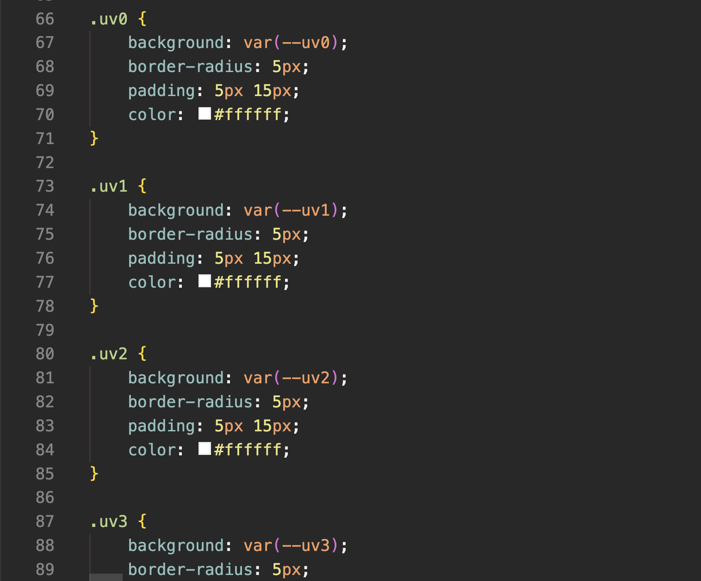
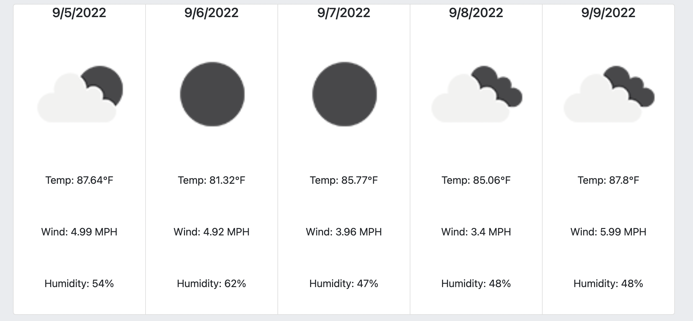
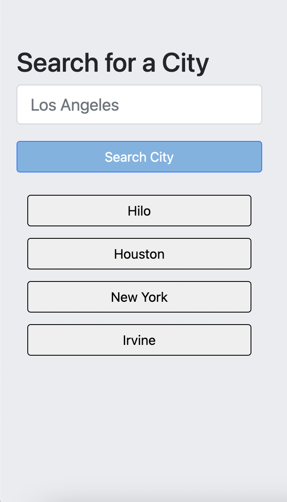
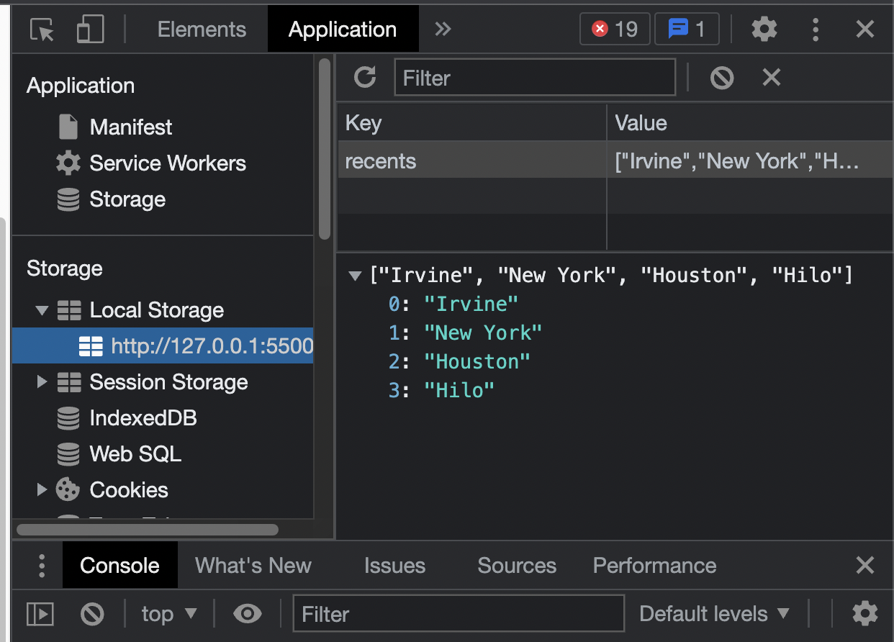
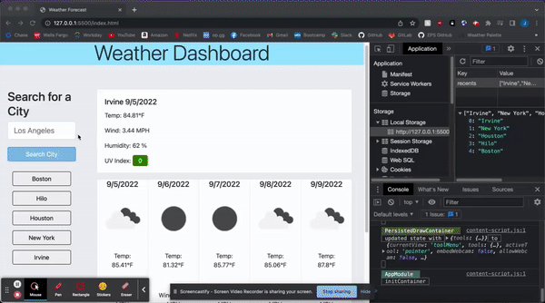

# Challenge Six: Server-Side APIs - Weather Dashboard

## Project Description

Challenge Six involved the implemention of OpenWeather's Api to display a city's current and five day weather forecast. The city's weather forecast includes information on temperature,  humidity,  wind speed, UV index, and an icon representation of the city's general weather conditions. Additionally, searches are stored locally and are rendered to the page as buttons, redisplaying that city's conditions if clicked. Documention on OpenWeather's Api was referenced from (https://openweathermap.org/api/one-call-api). 

### Application Screenshot

The following image shows the weather dashboard application:

### Current Forecast

The following image shows the weather dashboard displaying a city's temperature, wind speed, humidity, and UV Index. 

### UV Index Color

The UV index value, fetched from OpenWeather's Api, is rendered onto the page and then assigned a class according it's truncated value.

The class given to the index value changes the styling of the value displayed.

### Five Day Forecast

The following image shows a five day forecast for the city searched. Along with the weather conditions, an icon corresponding to the conditions is also displayed.

### Recent Searches and Local Storage

The following image shows recent search buttons added below the search bar. 

After a city is searched, it is added to an array which is saved to local storage. The result is then prepended to the list of recent searches.

In the following GIF, the city "Costa Mesa" is searched, displayed to the recent searches list, is stored, and is available to the user upon refresh.

### Link to Github Page
[https://jffsun.github.io/chall-six-weather-dashboard](https://jffsun.github.io/chall-six-weather-dashboard).

### Link to Github Repository
[https://github.com/jffsun/chall-six-weather-dashboard](https://github.com/jffsun/chall-six-weather-dashboard).